<div align="center">

# 📡 Tgnewsbot

**Telegram 新闻播报机器人**

自动采集 · AI 分类摘要 · 实时快讯 · 每日日报

[](https://www.python.org/)
[](https://github.com/LonamiWebs/Telethon)
[](https://python-telegram-bot.org/)
[](https://cursor.com/dashboard/api)
[](#-使用声明)

</div>

---

## ✨ 它能做什么

从你指定的 Telegram 频道自动拉取消息，过滤广告和重复报道，用 AI 分类、打分并生成一句话摘要，然后推送到你自己的频道：

| | 功能 | 说明 |
|---|------|------|
| 📡 | **自动采集** | Telethon 每 10 分钟（可配置）增量拉取多个源频道，SQLite 自动去重 |
| 🧹 | **广告过滤** | 内置广告黑名单，命中直接丢弃；支持 `词 +必须词 !排除词` 语法自定义规则 |
| 🔁 | **语义去重** | 同一事件被多个频道转发/改写也能识别，只处理一次（本地算法免费，可选 embedding 更准） |
| 🤖 | **智能分类** | 先走关键词规则，拿不准的交给 AI，六大类目：政治 / 科技 / 游戏 / 财经 / 社会 / 其他 |
| 📝 | **摘要 + 打分** | AI 提炼一句话要点，并给出 0-10 的新闻价值分 |
| ⚡ | **实时快讯** | 置信度与价值分双达标的消息即时推送，每轮限量防刷屏 |
| 📰 | **每日日报** | 每天定时（默认 21:00）按分类汇总发布 |
| 🎛 | **管理命令** | 私聊机器人即可管理：/addsource 加源、/threshold 调阈值、/pause 暂停、/report 出日报等 |
| 🔌 | **双 AI 后端** | Cursor SDK（用 Cursor 订阅的模型）或任何 OpenAI 兼容 API，都不配则纯规则运行 |

## 🔄 工作流程

整个流程分三个阶段，每 10 分钟（可配置）自动跑一轮：

<div align="center">
  
</div>

用文字说就是这五步：

1. **拉取**：机器人用你的 Telegram 账号（Telethon）每 10 分钟从源频道增量拉取新消息（记录每个频道的进度，不重复拉已处理过的）。
2. **过滤与去重**：先过广告黑名单（`tg_news_bot/config/blocklist.txt`，可自定义），命中直接丢弃；再做两层去重——逐字相同的直接跳过，同一事件被不同频道改写转发的也能识别跳过，不会重复调用 AI 浪费费用。
3. **分类、摘要与打分**：先用内置关键词规则判断类别（如“股市”→财经）；规则拿不准的才发给 AI，AI 返回类别、置信度、一句话摘要和 0-10 的新闻价值分。AI 没配置或调用失败时自动回退到规则结果，程序不会停。
4. **发快讯**：置信度 ≥ 0.7 且价值分 ≥ 6（都可配置）的消息，立即由 Bot 推送到目标频道；每轮最多发 5 条、只发新鲜消息，不会刷屏也不会把旧闻当快讯。
5. **发日报**：每天 21:00（可配置时间和时区），把当天所有消息按六大类目汇总，每类取置信度最高的 10 条，生成一份日报发到目标频道。

> 🎛 配置 `ADMIN_USER_IDS` 后，这一切都能在 Telegram 里私聊机器人管理：`/addsource` 加源频道、`/threshold` 调阈值、`/minscore` 调价值分门槛、`/pause` 暂停采集、`/report` 立即出日报、`/stats` 看统计，发 `/help` 查看全部命令。修改立即生效并持久化，无需登录服务器。
>
> 🛠 想改流程图？源码在 [`docs/workflow.mmd`](docs/workflow.mmd)，改完用 [mermaid-cli](https://github.com/mermaid-js/mermaid-cli) 重新导出 `docs/workflow.svg` 即可。

## 💡 应用场景

### 📱 个人信息聚合：把几十个频道压缩成一个

关注了一堆新闻、科技、财经频道，每天根本刷不完？把它们全部填进 `SOURCE_CHANNELS`，建一个自己的私人频道当目标：重要消息实时弹快讯，其余的晚上一份日报看完。从“刷十几个频道”变成“看一个频道”。

### 💼 行业情报监控：只盯你关心的那一类

做交易的盯财经、做游戏的盯游戏、做开发的盯科技。把行业相关频道设为源，在 `config/whitelist.txt` 里写几行关注规则（如 `苹果 特斯拉 !招聘`），就能把泛新闻流变成定制情报流。配合置信度和价值分阈值，噪音不会弹到你脸上。

### 👥 社群/团队资讯站：自动运营一个内容频道

给你的群友、同事或订阅者运营一个资讯频道，但不想每天手动搬运？把机器人挂在服务器上，它 24 小时自动选料、去广告、分类、写摘要、排版发布，每条快讯还带原文链接。日常管理在 Telegram 里发个命令就行。

### ✍️ 内容创作素材库：选题不再靠翻聊天记录

做自媒体、写周报、做播客的，每天的日报就是现成的选题清单。所有消息连同分类、摘要、价值分、原文链接都存在本地 SQLite（`news.db`）里，想回溯某个事件的时间线，一条 SQL 就能把相关消息全拉出来。

### 🔕 免打扰阅读：把推送主动权拿回来

不想被消息轰炸但又怕错过大事？给机器人发 `/minscore 8`，只有 AI 认为是重大突发的消息才会实时推送，其他全部攒到晚上日报一次性看。白天专心干活，晚上五分钟补完全天资讯。

> 💡 这些场景都不需要改代码：源频道、阈值用 Bot 命令或 `.env` 配；广告词和关注词改 `config/` 下的两个文本文件，改完发 `/reload` 即可生效。

## 🚀 快速开始

> 环境要求：**Python 3.9+**（推荐 3.11+）、一个 Telegram 账号、一个 Bot Token

```bash
# 1️⃣ 克隆仓库
git clone https://github.com/WoYinDao/Tgnewsbot-octo-umbrella.git
cd Tgnewsbot-octo-umbrella/tg_news_bot

# 2️⃣ 安装依赖
python3 -m venv venv && source venv/bin/activate
pip install -r requirements.txt

# 3️⃣ 生成配置（交互式向导）
python3 setup_guide.py

# 4️⃣ 验证配置
python3 verify_config.py

# 5️⃣ 启动（首次运行需输入 Telegram 验证码登录）
python3 app.py
```

或者在仓库根目录直接运行一键脚本：

```bash
./RUN_SETUP.sh
```

## 🔑 需要准备的凭证

| 配置项 | 获取方式 | 必需 |
|--------|----------|:----:|
| `TELETHON_API_ID` / `TELETHON_API_HASH` | [my.telegram.org/apps](https://my.telegram.org/apps) | ✅ |
| `TELEGRAM_BOT_TOKEN` | Telegram 内搜索 [@BotFather](https://t.me/BotFather) | ✅ |
| `TARGET_CHAT_ID` | 目标频道 ID（负数，如 `-1001234567890`） | ✅ |
| `SOURCE_CHANNELS` | 要采集的频道，逗号分隔 | ✅ |
| `CURSOR_API_KEY` | [Cursor Dashboard → API Keys](https://cursor.com/dashboard/api) | ⭕ AI 分类，二选一 |
| `OPENAI_API_KEY` | OpenAI / DeepSeek / OpenRouter / Ollama 等 | ⭕ AI 分类，二选一 |
| `ADMIN_USER_IDS` | 给 [@userinfobot](https://t.me/userinfobot) 发消息获取自己的 ID | ⭕ 启用管理命令 |

完整配置项见 [`tg_news_bot/.env.example`](tg_news_bot/.env.example)。

## 📂 仓库结构

<details>
<summary>点开查看目录说明</summary>

```
.
├── RUN_SETUP.sh        # 交互式快速启动脚本（配置/验证/启动三合一）
├── docs/               # 文档资源（工作流程图 SVG 及其 Mermaid 源码）
└── tg_news_bot/        # 机器人主体代码
    ├── app.py          # 程序入口
    ├── config.py       # 配置管理（读取 .env）
    ├── collector.py    # Telethon 增量采集
    ├── filters.py      # 广告黑名单 / 关注白名单过滤引擎
    ├── dedup.py        # 语义去重（相似报道识别）
    ├── classifier.py   # 规则 + AI 分类、摘要、价值打分（Cursor / OpenAI 双后端）
    ├── publisher.py    # Bot 发布（HTML 排版，解析失败自动降级）
    ├── bot_commands.py # Telegram 管理命令（/stats /addsource /threshold 等）
    ├── runtime.py      # 运行时配置（命令修改后持久化）
    ├── scheduler.py    # 定时任务（采集周期 + 日报 + 数据清理）
    ├── db.py           # SQLite 存储、去重、运行时设置
    ├── templates.py    # 快讯/日报排版模板
    ├── config/         # 过滤规则文件（blocklist.txt / whitelist.txt，可直接编辑）
    ├── setup_guide.py  # 交互式配置向导（生成 .env）
    ├── verify_config.py# 配置验证工具
    ├── .env.example    # 全部配置项示例
    └── README.md       # 详细文档（部署、常见问题）
```

</details>

## 📖 更多文档

详细的配置说明、**systemd 后台部署**、**常见问题排查**（登录失败、频道访问、FloodWait 限流等 9 个 Q&A），见：

👉 [`tg_news_bot/README.md`](tg_news_bot/README.md)

## 🔒 安全提醒

> [!WARNING]
> `.env`（密钥）、`*.session`（Telegram 登录凭证，等同账号密码）、`news.db` 已在 `.gitignore` 中，**绝对不要提交到 git**。
> 建议设置权限：`chmod 600 .env *.session`

## 📄 使用声明

本项目仅供学习和个人使用：仅通过官方 Telegram API 采集已加入的公开或已授权频道，不得用于非法采集、滥用或侵犯他人隐私。

---

<div align="center">

欢迎提交 [Issue](https://github.com/WoYinDao/Tgnewsbot-octo-umbrella/issues) 和 Pull Request 🎉

</div>
