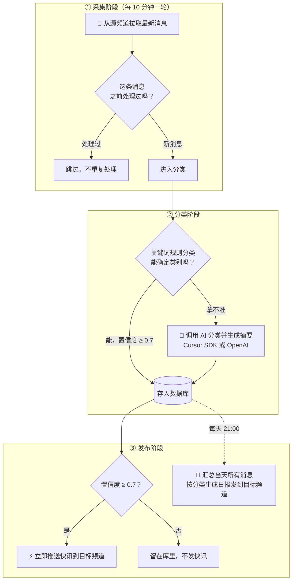

<div align="center">

# 📡 Tgnewsbot

**Telegram 新闻播报机器人**

自动采集 · AI 分类摘要 · 实时快讯 · 每日日报

[](https://www.python.org/)
[](https://github.com/LonamiWebs/Telethon)
[](https://python-telegram-bot.org/)
[](https://cursor.com/dashboard/api)
[](#-使用声明)

</div>

---

## ✨ 它能做什么

从你指定的 Telegram 频道自动拉取消息，用 AI 分类并生成一句话摘要，然后推送到你自己的频道：

| | 功能 | 说明 |
|---|------|------|
| 📡 | **自动采集** | Telethon 每 10 分钟（可配置）从多个源频道拉取，SQLite 自动去重 |
| 🤖 | **智能分类** | 先走关键词规则，拿不准的交给 AI，六大类目：政治 / 科技 / 游戏 / 财经 / 社会 / 其他 |
| 📝 | **一句话摘要** | AI 自动提炼消息要点 |
| ⚡ | **实时快讯** | 置信度达标的消息即时推送 |
| 📰 | **每日日报** | 每天定时（默认 21:00）按分类汇总发布 |
| 🔌 | **双 AI 后端** | Cursor SDK（用 Cursor 订阅的模型）或任何 OpenAI 兼容 API，都不配则纯规则运行 |

## 🔄 工作流程

整个流程分三个阶段，每 10 分钟（可配置）自动跑一轮：



用文字说就是这五步：

1. **拉取**：机器人用你的 Telegram 账号（Telethon）每 10 分钟从你配置的源频道拉取最新消息。
2. **去重**：处理过的消息直接跳过，只处理新消息，不会重复调用 AI 浪费费用。
3. **分类与摘要**：先用内置关键词规则判断类别（如“股市”→财经）；规则拿不准的才发给 AI，AI 返回类别、置信度和一句话摘要。AI 没配置或调用失败时自动回退到规则结果，程序不会停。
4. **发快讯**：置信度 ≥ 0.7（可配置）的消息，立即由 Bot 推送到你的目标频道；不达标的只存库不推送。
5. **发日报**：每天 21:00（可配置时间和时区），把当天所有消息按六大类目汇总，每类取置信度最高的 10 条，生成一份日报发到目标频道。

## 🚀 快速开始

> 环境要求：**Python 3.9+**（推荐 3.11+）、一个 Telegram 账号、一个 Bot Token

```bash
# 1️⃣ 克隆仓库
git clone https://github.com/WoYinDao/Tgnewsbot-octo-umbrella.git
cd Tgnewsbot-octo-umbrella/tg_news_bot

# 2️⃣ 安装依赖
python3 -m venv venv && source venv/bin/activate
pip install -r requirements.txt

# 3️⃣ 生成配置（交互式向导）
python3 setup_guide.py

# 4️⃣ 验证配置
python3 verify_config.py

# 5️⃣ 启动（首次运行需输入 Telegram 验证码登录）
python3 app.py
```

或者在仓库根目录直接运行一键脚本：

```bash
./RUN_SETUP.sh
```

## 🔑 需要准备的凭证

| 配置项 | 获取方式 | 必需 |
|--------|----------|:----:|
| `TELETHON_API_ID` / `TELETHON_API_HASH` | [my.telegram.org/apps](https://my.telegram.org/apps) | ✅ |
| `TELEGRAM_BOT_TOKEN` | Telegram 内搜索 [@BotFather](https://t.me/BotFather) | ✅ |
| `TARGET_CHAT_ID` | 目标频道 ID（负数，如 `-1001234567890`） | ✅ |
| `SOURCE_CHANNELS` | 要采集的频道，逗号分隔 | ✅ |
| `CURSOR_API_KEY` | [Cursor Dashboard → API Keys](https://cursor.com/dashboard/api) | ⭕ AI 分类，二选一 |
| `OPENAI_API_KEY` | OpenAI / DeepSeek / OpenRouter / Ollama 等 | ⭕ AI 分类，二选一 |

完整配置项见 [`tg_news_bot/.env.example`](tg_news_bot/.env.example)。

## 📂 仓库结构

<details>
<summary>点开查看目录说明</summary>

```
.
├── RUN_SETUP.sh        # 交互式快速启动脚本（配置/验证/启动三合一）
└── tg_news_bot/        # 机器人主体代码
    ├── app.py          # 程序入口
    ├── config.py       # 配置管理（读取 .env）
    ├── collector.py    # Telethon 采集
    ├── classifier.py   # 规则 + AI 分类（Cursor / OpenAI 双后端）
    ├── publisher.py    # Bot 发布（HTML 排版，解析失败自动降级）
    ├── scheduler.py    # 定时任务（采集周期 + 每日日报）
    ├── db.py           # SQLite 存储与去重
    ├── templates.py    # 快讯/日报排版模板
    ├── setup_guide.py  # 交互式配置向导（生成 .env）
    ├── verify_config.py# 配置验证工具
    ├── .env.example    # 全部配置项示例
    └── README.md       # 详细文档（部署、常见问题）
```

</details>

## 📖 更多文档

详细的配置说明、**systemd 后台部署**、**常见问题排查**（登录失败、频道访问、FloodWait 限流等 9 个 Q&A），见：

👉 [`tg_news_bot/README.md`](tg_news_bot/README.md)

## 🔒 安全提醒

> [!WARNING]
> `.env`（密钥）、`*.session`（Telegram 登录凭证，等同账号密码）、`news.db` 已在 `.gitignore` 中，**绝对不要提交到 git**。
> 建议设置权限：`chmod 600 .env *.session`

## 📄 使用声明

本项目仅供学习和个人使用：仅通过官方 Telegram API 采集已加入的公开或已授权频道，不得用于非法采集、滥用或侵犯他人隐私。

---

<div align="center">

欢迎提交 [Issue](https://github.com/WoYinDao/Tgnewsbot-octo-umbrella/issues) 和 Pull Request 🎉

</div>
